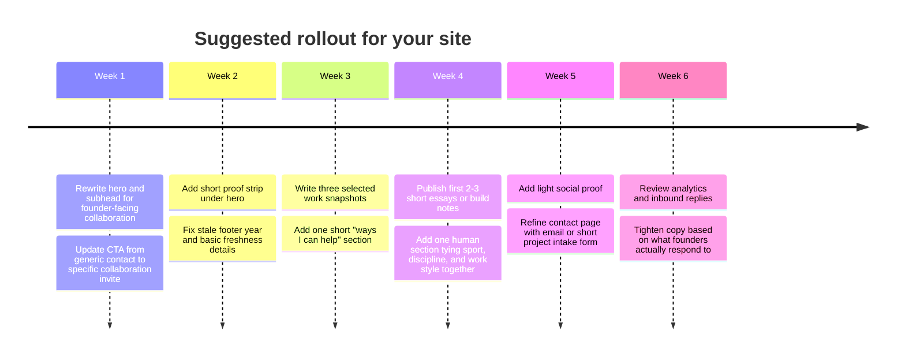

# Personal Website Inspiration for a Technical Founder

## Executive Summary

Your current site, urlsurdu.dehttps://surdu.de/, already communicates real substance: seniority, technical depth, product ownership, team leadership, scale, and a human side through sport and AI interests. But it still reads more like a concise executive bio than a founder-facing collaboration page. A visitor can quickly see that you are experienced; they cannot as quickly see what kind of founder you want to help, what kinds of problems you are best at, or what working with you would feel like. citeturn34view0

The best sites I reviewed do not win through visual cleverness. They win because they make credibility easy to verify, show evidence of follow-through, and still feel like a real person is behind the page. The closest fits for your goal are entity["people","Jason Cohen","startup founder and writer"], entity["people","Ryan Hoover","founder and investor"], entity["people","Sachin Rekhi","product founder and writer"], entity["people","Des Traynor","startup founder and writer"], and entity["people","Shreyas Doshi","startup advisor and product leader"]. They balance operator credibility with a tone that feels open, candid, and easy to approach. citeturn10search0turn26view0turn15view1turn7view6turn21view0turn15view2turn24view0turn15view3turn7view4turn20view1turn28view0turn19view0turn18search0

If you take one thing from this report, it should be this: your next version should move from **"here is my background"** to **"here is why founders trust me with hard product and technical work."** The strongest recurring patterns were a sharp first-person positioning line, immediate proof near the top, one clear collaboration CTA, visible writing or shipped work, and one humanizing layer that makes the person feel approachable rather than merely impressive. citeturn25view0turn19view0turn7view2turn21view1turn24view0turn22view2turn9view0turn33view0

## Assumptions and Evaluation Lens

I used the assumptions you specified: the likely audience is founders, technical co-founders, and early-stage startup collaborators; the tone target is trustworthy, reliable, and friendly; and there is no specific stack constraint. I also weighted examples higher when they felt useful for an operator with a technical background rather than for a pure coach, writer, or job-seeker.

I prioritized official personal sites and public LinkedIn profiles, then judged each site on five things: how fast it establishes credibility, how concrete the proof is, how clear the collaboration path is, how much technical substance it signals, and how approachable it feels. I link the exact pages reviewed. I did not embed third-party screenshot search results, because stale captures are less reliable than the live official pages for a site-review like this.

## What Your Current Site Signals Today

Your homepage already does a few important things right. It shows your face, makes contact available immediately, states your seniority, mentions scale, and shows an experience timeline that connects product and engineering roles. It also gives a small personal layer with Ironman and AI, which helps you feel like more than a résumé. Those are good trust starters. citeturn34view0

The main issue is positioning. The hero line frames you as "Senior Product Manager with 10+ years of experience in tech leadership," which is credible but employment-coded. The rest of the page continues in that mode: title, timeline, responsibilities, and one generic contact CTA. There is no clear founder-facing value proposition, no selected work, no visible proof beyond self-description, no testimonials, and no writing or build archive that shows how you think. In 2026, the footer still shows 2024, which is a small but real freshness signal problem. citeturn34view0

In plain terms, the current page says **"I have done serious work."** It does not yet say **"I am a dependable person to build with."** That is the gap the best reference sites solve. citeturn34view0turn10search0turn25view0turn19view0turn21view1turn24view0

## Comparison Table

The ratings below are my judgment after reviewing the official sites and LinkedIn profiles.

| Site | Fit for your goal | Visual tone | Proof types | CTA | Technical depth | Friendliness |
| --- | --- | --- | --- | --- | --- | --- |
| urlJason Cohenhttps://longform.asmartbear.com/jason-cohen/ | Very high | Editorial, text-first, substantial | founder history, exits, unicorns, talks, mailing list | Subscribe, then social contact | High | High citeturn10search0turn26view0turn15view1 |
| urlRyan Hooverhttps://www.ryanhoover.me/ | Very high | Casual founder-builder | company/project list, essay archive, investor role, recommendations | Explore writing/projects, then reach out | Medium-high | Very high citeturn7view6turn21view0turn21view1turn15view2turn29view0 |
| urlSachin Rekhihttps://www.sachinrekhi.com/ | Very high | Practical, product-operator | essay count, view count, talks, founder role, courses | Subscribe or contact | High | Medium-high citeturn24view0turn15view3 |
| urlDes Traynorhttps://destraynor.com/ | High | Candid, text-led, unpolished by choice | founder role, talk archive, essays, podcast history, LinkedIn recommendations | Read/watch, then social | Medium | High citeturn7view4turn20view0turn20view1turn28view0turn28view1 |
| urlShreyas Doshihttps://shreyasdoshi.com/ | High | Clear advisory/operator | elite background, follower count, explicit services, scarcity | "Let's Work Together" | Medium | Medium citeturn19view0turn18search0 |
| urlBrian Balfourhttps://brianbalfour.com/ | High | Polished, strategic, professional | founder role, prior leadership, advisor list, courses, podcast | Subscribe, follow, email | Medium-high | Medium citeturn25view0turn25view1turn25view2turn17search2turn17search1 |
| urlLenny Rachitskyhttps://lennyrachitsky.com/ | High | Friendly creator-operator | audience size, podcast, investing page, recommendations | Subscribe, contact form | Medium | Very high citeturn7view2turn14view0turn14view1turn16view0turn30view0 |
| urlKent C. Doddshttps://kentcdodds.com/ | Selective high | Warm, illustrative, community-led | content stats, courses, community, contact options | Blog/course/community/contact | High | Very high citeturn22view2turn22view3turn22view1turn15view4 |
| urlSimon Willisonhttps://simonwillison.net/ | Selective high | Utility-first, transparent, deeply technical | long archive, tools, disclosures, source transparency, board/service credentials | Subscribe, browse tools | Very high | Medium-high citeturn9view0turn9view2turn8view6turn27view1turn27view2 |
| urlGibson Biddlehttps://www.gibsonbiddle.com/ | Selective high | Workshop-first, older template | former leadership roles, testimonials, NPS, newsletter size | Email inquiry | Medium | Medium-high citeturn33view0turn35view0turn31search18 |

## Ten Sites Reviewed

**Jason Cohen**  
Official links: urlPersonal sitehttps://longform.asmartbear.com/jason-cohen/ · urlLinkedIn profilehttps://www.linkedin.com/in/jasoncohen

**Bio:** Jason Cohen is a four-time entrepreneur with a long operating history across bootstrapped and funded startups. His site highlights two exits, two unicorns, a long-running mailing list, investing, and a speaking archive. LinkedIn reinforces that he has built four technology startups. citeturn10search0turn15view1turn26view0

**Why relevant to your goal:** This is one of the best examples of a technical founder site that feels both serious and human. It does not try to "brand" him into something abstract. It tells you, very plainly, why his judgment should matter. That is exactly the move your own site needs. citeturn10search0turn26view0

**Signals:** Visual—text-first editorial layout, which reads as substance-first. Copy—plain, candid, first-person, with zero hype. Social proof—specific startup outcomes, investing history, and a talk archive. CTA—newsletter subscription first, social contact second. Portfolio—deep writing archive plus talks and special links. Testimonials—no dedicated testimonial block. Contact—easy social reach-outs in the footer. citeturn10search0turn26view0

**What to consider adopting:** A short proof-heavy founder bio near the top, a visible "selected thinking / selected talks" layer, and a footer that makes contact feel personal instead of transactional. Also worth borrowing: his specificity. He does not say he is "passionate about startups." He says what he built and what happened. citeturn10search0turn26view0

**Critique:** The site is superb for authority, but a first-time founder looking for "how can Jason help me right now?" still has to infer the answer from essays rather than see it stated plainly. citeturn10search0turn26view0

**Brian Balfour**  
Official links: urlPersonal sitehttps://brianbalfour.com/ · urlLinkedIn profilehttps://www.linkedin.com/in/bbalfour

**Bio:** Brian Balfour is founder and CEO of urlReforgehttps://www.reforge.com and previously led growth at urlHubSpothttps://www.hubspot.com. His site also notes four co-founded companies, multiple acquisitions, active investing/advising, and a preference for publishing less often with higher quality. citeturn25view0turn17search2turn17search1

**Why relevant to your goal:** His site is a good model for "serious operator, clean structure, no fluff." It is useful if you want your site to feel credible to founders and product leaders without becoming overly personal or casual. citeturn25view0turn25view1turn25view2

**Signals:** Visual—clean navigation split into essays, quick takes, courses, podcast, and about. Copy—strategic and disciplined, with a clear quality-over-quantity stance. Social proof—role pedigree, advisor list, course partners from major companies, and an artifact portfolio tied to his podcast. CTA—subscribe, follow, or email. Portfolio—strong essay, course, and podcast portfolio. Testimonials—not front-and-center on the site, but LinkedIn recommendations are visible. Contact—direct email plus social follow links. citeturn25view0turn25view1turn25view2turn17search2

**What to consider adopting:** A tighter information architecture, a "selected expertise areas" menu, and a proof system that includes advisory roles or recognizable collaborators. If you ever want your site to support speaking, advisory work, or workshop offers, this is a very strong structural reference. citeturn25view0turn25view1

**Critique:** It is polished and credible, but emotionally it runs cool; for your goal, you would want more warmth and more personal texture than Brian uses. citeturn25view0turn25view1

**Shreyas Doshi**  
Official links: urlPersonal sitehttps://shreyasdoshi.com/ · urlLinkedIn profilehttps://www.linkedin.com/in/shreyasdoshi

**Bio:** Shreyas Doshi presents himself as a startup advisor and former product leader with experience at major tech companies, and LinkedIn shows an unusually deep background across product leadership and advising. His site is built around advising, teaching, speaking, and writing. citeturn18search0turn19view0

**Why relevant to your goal:** This is the clearest reference for turning expertise into a collaboration offer. If your site should help founders think "this person can help me solve product and execution problems," Shreyas shows exactly how to say that in one screen. citeturn19view0

**Signals:** Visual—straightforward WordPress layout with no mystery about what he offers. Copy—high-agency, explicit, and specific about founders, strategy, GTM, leadership, and hiring. Social proof—400k+ followers, elite background, visible recent content, and scarcity around advising slots. CTA—"Let's Work Together." Portfolio—writing, courses, speaking, and embedded social updates. Testimonials—none prominently featured on the homepage. Contact—clear contact path plus newsletter signup. citeturn19view0turn19view1turn18search0

**What to consider adopting:** The clarity of the promise. A founder should know in seconds whether you help with product strategy, product-technical execution, early monetization, or team leadership. You do not need to become an advisor site, but you should borrow this precision. citeturn19view0

**Critique:** The site is sharp and effective, but it feels more like a premium advisor platform than a peer-like builder site, so you should borrow the precision without copying the tone too literally. citeturn19view0

**Lenny Rachitsky**  
Official links: urlPersonal sitehttps://lennyrachitsky.com/ · urlLinkedIn profilehttps://www.linkedin.com/in/lennyrachitsky

**Bio:** Lenny writes Lenny's Newsletter, hosts a major product podcast, invests actively, and previously spent seven years at urlAirbnbhttps://www.airbnb.com after earlier engineering and founder experience. His site and LinkedIn both emphasize product, growth, and career advice at scale. citeturn16view0turn7view2

**Why relevant to your goal:** Lenny is the strongest example of a friendly, modern product-operator brand that still feels useful and approachable. He has huge scale, but the homepage still sounds like a person talking, not a media company. citeturn7view2turn16view0

**Signals:** Visual—clean, soft, minimal. Copy—friendly, useful, first-person, and low-ego. Social proof—1,000,000+ subscribers, podcast, investing page, patents and recommendations on LinkedIn. CTA—subscribe first, then direct contact via a simple form. Portfolio—newsletter, podcast, investing page, and product bot. Testimonials—LinkedIn recommendations, but no homepage testimonial wall. Contact—very easy. citeturn7view2turn14view0turn14view1turn16view0turn30view0

**What to consider adopting:** A warmer headline voice, a dead-simple contact page, and a "things I do" nav that makes your range feel coherent instead of scattered. His site also shows how to make multiple activities feel like one identity. citeturn7view2turn14view0

**Critique:** Lenny's scale is a huge asset for him, but if copied too directly it could push your site toward creator-brand territory instead of founder-collaborator territory. citeturn7view2turn14view1

**Ryan Hoover**  
Official links: urlPersonal sitehttps://www.ryanhoover.me/ · urlLinkedIn profilehttps://www.linkedin.com/in/ryanrhoover

**Bio:** Ryan Hoover is founder of urlProduct Hunthttps://www.producthunt.com and investor at urlWeekend Fundhttps://www.weekend.fund. His personal site combines writing, project history, and current experiments, while LinkedIn shows both product leadership and strong peer recommendations. citeturn7view6turn15view2turn29view0

**Why relevant to your goal:** Ryan's site is one of the best reference points if you want to feel like a credible founder-friendly builder rather than a consultant. It is relaxed, current, and obviously made by someone who ships things. citeturn7view6turn21view0turn21view1

**Signals:** Visual—casual, sparse, and confident. Copy—short, human, and curious. Social proof—founder role, fund, 200+ essays, and project list. CTA—browse writing or explore projects, then naturally reach out. Portfolio—excellent projects section plus long writing archive. Testimonials—public LinkedIn recommendations reinforce diligence and trust. Contact—not explicit on the homepage, but the broader ecosystem of projects and the fund create easy paths in. citeturn7view6turn21view0turn21view1turn29view0

**What to consider adopting:** A "projects / experiments / things I'm building" section would be especially strong for you. Founders often trust technical collaborators more when they can see current activity, not just past roles. citeturn7view6turn21view1

**Critique:** The site is wonderfully approachable, but it is light on an explicit "how I help" statement, so you would want to combine Ryan's warmth with more direct collaboration framing. citeturn7view6turn21view0

**Des Traynor**  
Official links: urlPersonal sitehttps://destraynor.com/ · urlLinkedIn profilehttps://ie.linkedin.com/in/destraynor

**Bio:** Des Traynor is co-founder of urlIntercomhttps://www.intercom.com and says he spent about 14 years there, primarily in product and marketing. His personal site collects essays, speaking, podcast appearances, and investments. LinkedIn shows industry reputation and multiple recommendations. citeturn7view4turn28view0turn28view1

**Why relevant to your goal:** Des is one of the best examples of credibility without corporate stiffness. His site feels candid and real. That matters if you want to be seen as dependable but not formal or distant. citeturn7view4turn20view1

**Signals:** Visual—deliberately simple and rough around the edges. Copy—dry, candid, and experience-backed. Social proof—Intercom pedigree, about 100 talks, podcast appearances, and public writing. CTA—read, watch, or follow. Portfolio—excellent archive of essays and talks. Testimonials—LinkedIn recommendations and reputation signals, but not a dedicated testimonial section on the site. Contact—social channels, but no obvious direct form or email on the homepage. citeturn20view0turn20view1turn20view2turn28view0turn28view1

**What to consider adopting:** His tone. He sounds like someone who has done the work and has no need to oversell. Also useful: the separation between writing, talks, and podcast appearances. That creates a strong "evidence of thought" layer. citeturn20view0turn20view1

**Critique:** The roughness is charming, but for your site you should keep the candor and drop the roughness; you want "approachable operator," not "side blog." citeturn7view4turn20view1

**Sachin Rekhi**  
Official links: urlPersonal sitehttps://www.sachinrekhi.com/ · urlLinkedIn profilehttps://www.linkedin.com/in/sachinrekhi

**Bio:** Sachin Rekhi says he has written 175+ essays with more than 3 million views, spent two decades building productivity products, and is currently founder and CEO of urlNotejoyhttps://notejoy.com. He also lists talks at major universities and companies and offers courses and workshops. citeturn24view0turn15view3

**Why relevant to your goal:** This is one of the best fits for a technical-product founder profile. He looks like someone who ships, reflects, teaches, and can be trusted with real work. The balance between operator proof and practical generosity is very strong. citeturn24view0

**Signals:** Visual—clean and practical, with clear category navigation. Copy—specific, experienced, and useful. Social proof—essay count, view count, founder role, and well-known speaking venues. CTA—subscribe, take a course, or reach out. Portfolio—strong across essays, videos, courses, and workshops. Testimonials—no big testimonial wall on the homepage. Contact—direct outreach invitation on the about page. citeturn24view0turn7view5

**What to consider adopting:** A "selected thinking + selected work" structure, plus visible numbers that show consistency over time. You likely do not need courses, but you could absolutely use a section for builds, notes, and product essays or short memos. citeturn24view0

**Critique:** The site leans slightly toward educator-brand positioning, so if you borrow from it, keep the operator credibility and leave the course-heavy layer lighter. citeturn24view0

**Kent C. Dodds**  
Official links: urlPersonal sitehttps://kentcdodds.com/ · urlLinkedIn profilehttps://www.linkedin.com/in/kentcdodds

**Bio:** Kent positions himself as a software engineer and educator helping people build better software, with a current focus on product engineering. His site includes a video intro, big course footprint, content statistics, a community space, and multiple direct contact options. citeturn22view2turn22view3turn15view4

**Why relevant to your goal:** Kent is less of a founder-collaborator reference and more of an approachability reference. If you want your technical depth to feel warm instead of intimidating, this is one of the best sites to study. citeturn22view2turn22view3

**Signals:** Visual—illustrated, playful, and personal. Copy—clear mission language with a lot of warmth. Social proof—blog readership stats, flagship courses, and visible testimonials/testimony pages. CTA—blog, course, community, office hours, email, or call. Portfolio—very broad content and course portfolio. Testimonials—explicitly available, unlike many other examples here. Contact—excellent. citeturn22view0turn22view1turn22view2turn22view3

**What to consider adopting:** A short intro video, a warmer "about me" section, and more than one contact path. Even if you never want to become content-first, Kent shows how to make expertise feel generous and safe. citeturn22view2turn22view3

**Critique:** It is more educator-community site than founder-business-partner site, so treat it as inspiration for tone and human warmth, not for overall structure. citeturn22view2turn22view3

**Simon Willison**  
Official links: urlPersonal sitehttps://simonwillison.net/ · urlLinkedIn profilehttps://www.linkedin.com/in/simonwillison

**Bio:** Simon Willison's about page identifies him as creator of entity["software","Datasette","open source data publishing tool"], co-creator of entity["software","Django","web framework"], an independent open-source developer, and a blogger since 2002. His site also details newsletter options, commercial disclosures, and public source code for the site itself. citeturn9view0turn27view1turn27view2

**Why relevant to your goal:** Simon is the strongest trust reference for technical credibility and transparency. He is less about business-partner warmth and more about intellectual reliability, but that is valuable for a technical founder site. citeturn9view0turn9view2

**Signals:** Visual—utility-first and dense, but intentionally so. Copy—transparent and precise. Social proof—tools, long archive, board/service credentials, and consistent recent publishing. CTA—subscribe, follow, or browse tools. Portfolio—exceptionally strong through tools, posts, feeds, and public code. Testimonials—not emphasized. Contact—indirect, through newsletter/social layers rather than a business CTA. citeturn9view0turn9view2turn8view6

**What to consider adopting:** The transparency layer. A short "colophon," public explanation of how your site is built, or a "what I'm exploring now" section can quietly increase trust among technical founders. citeturn9view0turn9view2

**Critique:** It is superb for technical trust, but it is too information-dense and too blog-forward to copy directly if your main goal is collaboration outreach. citeturn9view0turn8view6

**Gibson Biddle**  
Official links: urlPersonal sitehttps://www.gibsonbiddle.com/ · urlLinkedIn profilehttps://www.linkedin.com/in/gibsonbiddle

**Bio:** Gibson Biddle presents himself as a former VP of Product at urlNetflixhttps://www.netflix.com and former CPO of urlChegghttps://www.chegg.com who now mentors, coaches, teaches, and runs product strategy talks and workshops. His site also highlights a free newsletter with 30,000+ members. citeturn33view0turn35view0turn31search18

**Why relevant to your goal:** Gibson is useful because he shows an older but very clear model for service-led trust. He is not the best visual reference, but he is a strong proof-reference. citeturn33view0

**Signals:** Visual—older template, obviously functional rather than refined. Copy—clear, service-oriented, and low-mystery. Social proof—major former roles, workshop NPS, named testimonials, newsletter size, and visible event schedule. CTA—email inquiry for talks and workshops. Portfolio—talks, workshops, articles, and recent events. Testimonials—excellent and explicit. Contact—excellent. citeturn33view0

**What to consider adopting:** A small testimonial layer and a proof block with public metrics. Even two short external endorsements or one measured outcome can do a lot for a founder-facing site like yours. citeturn33view0

**Critique:** The site proves the point that social proof matters, but the templated rough edges and leftover placeholder text reduce polish and would be a mistake to copy. citeturn33view0

## Recommended Direction for Your Site

The strongest direction for your site is not to become a creator site, coach site, or résumé site. It is to become a **technical founder-friendly operator site**. That means your homepage should answer five questions fast: who you help, what you help with, why someone should trust you, how you think, and how to contact you. That is the shared core across the best references above, even though their visual styles differ a lot. citeturn10search0turn25view0turn19view0turn21view1turn24view0turn20view1

A strong structure for your update would look like this:

1. **Rewrite the hero for collaboration, not employment.**  
   Replace the current role-title hero with a value statement such as: *Technical product leader for founders building ambitious products* or *I help early-stage teams turn product ideas into shipped, scalable software and better product decisions.* Your current title is credible, but it sounds like a CV headline. citeturn34view0

2. **Add a proof strip directly under the hero.**  
   Keep it short and concrete. Example: *10+ years across product and engineering · led multidisciplinary teams · shipped products with millions of users · owned product P&L.* This borrows the specificity of Jason, Brian, and Sachin. citeturn34view0turn10search0turn25view0turn24view0

3. **Create a selected work section.**  
   Not a full portfolio. Just three concise case snapshots: problem, your role, what changed, and one measurable outcome. Ryan's projects section and Sachin's practical archive are the closest models here. citeturn7view6turn21view1turn24view0

4. **Add a "Ways I can help" section.**  
   This is the clearest missing layer on your site. You could frame it as: *product strategy for early products*, *technical/product translation between founders and teams*, and *shipping support from idea to live ops*. Shreyas is the strongest reference for making this explicit without sounding needy. citeturn19view0

5. **Publish a small thinking layer.**  
   Even 4–6 short essays or build notes are enough. They do not need to be polished thought leadership. They need to show judgment. Jason, Des, and Simon all benefit from visible thinking, though in different styles. citeturn26view0turn20view0turn9view0

6. **Keep one humanizing section.**  
   Your Ironman note is good. Keep that kind of texture, but tie it back to how you work: discipline, consistency, resilience, long-range thinking. Kent is the best example of making skill and personality reinforce each other. citeturn34view0turn22view2turn22view3

One more small but important change: automate the footer year and add a clearer contact CTA such as **Tell me what you're building**. Small details like stale dates and generic CTAs subtly weaken trust. citeturn34view0

## Rollout Timeline

The right order is messaging first, then proof, then examples, then polish. If you polish the current structure before changing the positioning, the site will still feel résumé-like.

